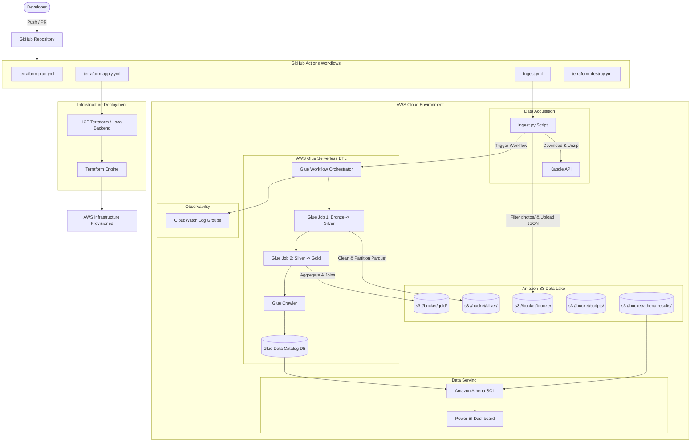

# Final Architecture Documentation — Yelp Big Data Platform

This document describes the design, execution flow, and architectural principles of the automated Yelp Big Data pipeline.

---

## High-Level Architecture Diagram

---

## Architectural Principles & Highlights

1. **Separation of Concerns**:
   - **Terraform** provisions all infrastructure declaratively.
   - **GitHub Actions** automates CI/CD and data ingestion execution.
   - **AWS Glue** handles heavy distributed PySpark transformations.
   - **Athena & Power BI** serve query traffic and business insights.

2. **Data Lake Medallion Architecture**:
   - **Bronze**: Raw JSON dataset files ingested directly from Kaggle.
   - **Silver**: Cleaned, schema-enforced, partitioned Parquet tables.
   - **Gold**: Business-level aggregated KPI metrics optimized for BI queries.

3. **AWS Academy Compatibility**:
   - Designed to work smoothly under AWS Academy Learner Lab constraints (customizable `var.glue_service_role_arn` to inherit `LabRole`).
   - On-demand lifecycle automation with `terraform-destroy.yml` to prevent unwanted cost accumulation.
